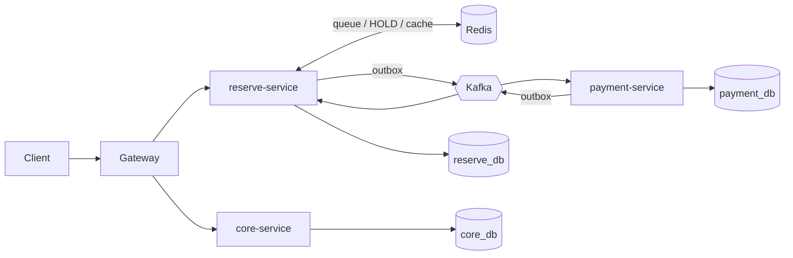

# 티케팅 대기열 백엔드

티켓 오픈 순간의 트래픽 폭증, 좌석 동시성, 결제 분산 트랜잭션을 1인으로 처음부터 끝까지 다뤄본 학습 프로젝트입니다.

> 4년차 백엔드 개발자가 MSA·대용량 트래픽·운영 감각을 직접 손으로 익히려고 만든 저장소입니다.  프로덕션을 흉내 낸 설계가 아니라, **각 결정의 근거를 본인이 설명할 수 있는 수준**까지 가는 걸 목표로 했습니다.

## 왜 티케팅 도메인인가

티케팅은 백엔드 입장에서 풀어야 할 문제가 한꺼번에 몰립니다.

- 오픈 순간 트래픽이 평소의 수십~수백 배로 튑니다 — 게이트웨이·핫패스 분리·큐잉이 필요합니다
- 좌석은 한정 자원이라 동시성 한 줄이 곧 비즈니스 사고로 이어집니다 — 락 전략이 비즈니스 특성에 맞아야 합니다
- 결제는 외부 시스템 호출이라 실패가 흔합니다 — 분산 트랜잭션과 보상 흐름이 필요합니다
- 결제 실패 시 좌석을 자동으로 풀어줘야 합니다 — 보상 saga와 타임아웃 관리가 필요합니다

스스로 한꺼번에 부딪혀 보고 싶은 기술 주제가 거의 다 들어 있어서 골랐습니다.

## 시스템 한 눈에



- **gateway** — Spring Cloud Gateway. 단일 진입점, 라우팅, 통합 Swagger
- **reserve-service** — 좌석 예약과 대기열의 핫패스. Saga 오케스트레이터가 여기 삽니다
- **core-service** — 이벤트 라이프사이클과 유저. 트래픽이 가벼운 콜드패스라 단일 인스턴스로 두었습니다
- **payment-service** — Kafka 명령으로 결제 처리. 결과를 다시 Kafka로 돌려보냅니다

DB는 서비스마다 분리(reserve_db / core_db / payment_db)했고, 단일 PostgreSQL 컨테이너 안에 데이터베이스만 나눠 운영합니다.

## 의사결정과 그 근거

### Saga는 코레오그래피가 아니라 오케스트레이션으로

서비스가 둘뿐이라 코레오그래피로 풀어도 충분히 돌아갑니다. 그럼에도 오케스트레이션을 고른 이유는 세 가지였습니다. 첫째, 한 트랜잭션의 진행 상태가 한 군데(`saga` 테이블)에 모이기 때문에 디버깅과 관측이 훨씬 수월합니다. 둘째, 타임아웃 정책이 서비스마다 흩어지지 않고 오케스트레이터의 스케줄러 한 곳에서 일괄 관리됩니다. 셋째, 보상 트랜잭션도 한 곳에 모여 있어 실패 분기가 코드로 명확히 보입니다.

### 좌석 락 전략을 한 가지로 통일하지 않았습니다

`SECTION_SELECT`(구역만 고르고 좌석은 자동 배정)는 `FOR UPDATE SKIP LOCKED`로 풀었고, `SEAT_PICK`(좌석을 직접 고름)은 낙관적 락(`@Version`) + Redis Lua HOLD를 조합했습니다. 한 가지 락으로 통일하지 않은 이유는 단순합니다. 5만 좌석 규모에서 SEAT_PICK 인기 좌석은 동시 요청이 몰리는데, 비관적 락으로 풀면 대기 행렬이 길어지고 낙관적 락만 쓰면 충돌률이 비현실적으로 높아집니다. AVAILABLE→RESERVED 두 상태만 있으면 "결제하는 동안" 좌석이 비어 보이는 시간이 생겨서 늦은 요청이 거의 다 실패합니다. 그래서 중간에 HOLD 상태를 두되, DB로 풀면 락 점유 시간이 너무 길어져서 Redis Lua로 옮겼습니다. SECTION 쪽은 어떤 좌석이든 비어 있으면 되니까 SKIP LOCKED가 의미가 살아나서 그쪽으로 갔습니다.

### Outbox + at-least-once + 멱등성

DB와 Kafka는 다른 시스템이라 한 트랜잭션으로 묶을 수 없습니다. 직접 발행하면 "DB는 커밋됐는데 Kafka 발행은 실패" 또는 그 반대가 언제든 일어납니다. Outbox는 같은 트랜잭션에서 outbox 테이블에 메시지도 같이 INSERT해서 "DB 커밋 = 메시지 발행 약속"으로 만듭니다. 대신 별도 publisher가 비동기로 발행하니 at-least-once가 됩니다. 즉, 컨슈머는 같은 메시지를 두 번 받아도 깨지지 않아야 합니다. 그래서 Saga 상태(step·status)를 가드로 써서 "이미 처리한 단계는 다시 와도 무시"하는 멱등성 가드를 모든 핸들러에 붙였습니다. 직접 발행 → 사고 → 재처리 흐름을 머리로만 돌려보다가, 코드로 박아 두니 의미가 다르게 다가왔습니다.

### Redis-first

대기열 순번·HOLD·이벤트 캐시 같은 핫패스 데이터는 Redis가 1차 저장소입니다. DB는 영속·재해 복구용입니다. 캐시 aside가 아니라 Redis 자체가 source of truth에 가깝습니다. 그러다 보니 "DB 트랜잭션 커밋 후 Redis ZREM이 실패하면 큐에 잔재가 남는다" 같은 결함이 생기는데, 이건 보정 스케줄러로 해소하는 방향으로 잡았습니다. Redis-first가 공짜가 아니라는 걸 솔직히 인정하면서 가는 중입니다.

## 직접 부딪힌 문제 셋

### 1. dispatch가 1 pod에서만 돌고 있었습니다 — RPS 1,200 → 3,032

`reserve-service`에 5 replicas를 띄웠는데 RPS가 안 올라갔습니다. 메트릭부터 봤더니 큐 dispatch가 글로벌 락 한 줄에 묶여서 5개 중 1개 pod만 활성이었습니다. 락 키를 `lock:queue-dispatch:{eventId}`로 이벤트별로 쪼개고, pod별로 시작 오프셋(`podId.hashCode() % openEventIds`)을 회전시켜 분산했습니다. 하는 김에 한 번에 10만 건씩 popping하던 걸 1,000으로 줄여 head-of-line을 풀었습니다.

reserve.queue 토픽이 `NewTopic` bean으로 10 파티션을 명시했는데도 broker엔 1 파티션으로 박혀 있었습니다. 원인을 추적해 보니 Spring Kafka의 `KafkaAdmin`이 부팅 시 broker가 아직 안 떠 있으면 silent skip하는 race가 있었고, 그러는 사이 publish가 broker auto-create를 발동시켜 default 1 파티션이 생긴 채로 굳어버린 것이었습니다. `setFatalIfBrokerNotAvailable=true` + Kubernetes initContainer로 broker 준비 전엔 부팅 자체를 실패시키도록 막았습니다.

gateway쪽에서 http커넥션풀이 가득차 503에러 및 800tps밖에 수용 못하는 것을 확인했습니다. gateway도 스케일을 일단 3개로 늘렸고 유의미한 tps증가로 이어졌습니다.

결과는 1,200 RPS → 3,032 RPS입니다. 다만 솔직하게 적자면, gateway를 1→3 replicas로 늘린 효과가 같이 들어가 있어서 per-event 락 효과만 따로 떼어낸 건 아닙니다. 정확한 분리 측정은 부하 발생기를 별도 박스로 옮긴 다음에야 가능합니다 — 지금은 발생기와 시스템이 같은 맥북에서 도니까 박스 CPU에 측정값이 수렴해버립니다.

### 2. 좌석 race condition — Redis Lua + SQL 락의 조합

처음엔 AVAILABLE→RESERVED 두 상태로 시작했습니다. 같은 좌석에 동시에 들어온 요청 중 늦은 쪽이 거의 다 실패했고, 그 사이 결제 페이지로 넘어간 사용자가 결제 도중 좌석을 뺏기는 케이스도 보였습니다. 중간 HOLD 상태가 필요해서 처음엔 DB 컬럼으로 풀었는데, 결제 페이지 머무는 시간 동안 row 락이 잡혀서 다른 좌석 조회까지 영향을 받았습니다.

Redis Lua 스크립트(`try_hold_seat.lua`)로 옮기고, HOLD는 TTL로 자동 만료시켰습니다. 별도 sweeper는 두지 않았습니다. 만료된 HOLD는 다음 시도에서 자연스럽게 재검증되니까 굳이 청소 잡을 띄울 필요가 없다고 판단했습니다. SECTION_SELECT 쪽은 결이 다른 문제라 SKIP LOCKED로 따로 풀었습니다 — 어떤 좌석이든 비어 있으면 되는 시나리오라 그쪽이 자연스럽습니다.

### 3. NeonDB → 로컬 PostgreSQL — 60ms → 0.1ms

부하 테스트 신뢰성이 안 나와서 latency 분포를 봤더니 DB 왕복이 ~60ms였습니다. NeonDB가 싱가포르 리전이라 한국에서 RTT가 그대로 깔리고 있었습니다. 단일 PostgreSQL 컨테이너 안에 reserve_db / core_db / payment_db로 데이터베이스만 분리해서(DB per Service 원칙은 유지) 로컬로 옮겼습니다. 약 600배 단축됐습니다. 작은 변경이지만 이후 모든 튜닝 의사결정의 측정 토대가 됐습니다.

## 측정 결과

| 항목 | 값 | 비고 |
|---|---|---|
| enqueue 천장 RPS | ~3,032 | gateway 3 / reserve 5 replicas, 부하기 동일 박스 |
| 좌석 데이터 규모 | 50,000 석 | SECTION + SEAT 혼합 시나리오 |
| DB 왕복 latency | ~0.1ms (NeonDB 시절 ~60ms) | 로컬 PostgreSQL 컨테이너 |
| Saga 단계 | 좌석 배정 → Payment(PENDING) 생성 → Process → 좌석 RESERVED 확정 / 보상 | |

측정 환경은 단일 맥북 + OrbStack + 부하 발생기 동거입니다. 외부 부하기로 옮기기 전엔 박스 CPU 한도가 곧 측정 천장이라는 점을 감안하시기 바랍니다.

## 기술 스택

- **Kotlin 2.2.21 / Java 21**
- **Spring Boot 4.0.5**
- **Apache Kafka 4.1.0 (KRaft)**
- **PostgreSQL**
- **Redis** — 대기열, HOLD, 캐시, 분산 락
- **Kubernetes (OrbStack)** — Deployment, Service, Ingress, ConfigMap/Secret
- **Prometheus + Grafana** — JVM·HTTP·Kafka·커스텀 saga 메트릭, 대시보드
- **Locust** — 부하 테스트
- **Docker Compose** — 로컬 개발 환경

## 빠른 실행

### Docker Compose

```bash
./gradlew build
docker compose up -d --build
# Swagger: http://localhost:8988/swagger-ui/index.html
```

### Kubernetes (OrbStack)

```bash
./gradlew build
bash kubernetes/scripts/deploy.sh
# API: http://localhost:8080/api/v1/events
# Grafana: kubectl port-forward svc/grafana 3000:3000
```

### 부하 테스트 (Locust)

```bash
cd reserve-service/loadtest
source .venv/bin/activate
locust -f enqueue_burst.py --host http://localhost:8080
# UI: http://localhost:8089
```

## 프로젝트 구조

```
├── common/             공유 라이브러리 (이벤트 DTO, Outbox, 캐시 키, 예외)
├── gateway/            API Gateway
├── reserve-service/    좌석 예약 + 대기열 + Saga 오케스트레이터 (핫패스)
│   └── loadtest/       Locust 부하 테스트
├── core-service/       이벤트 라이프사이클 + 유저 (콜드패스)
├── payment-service/    결제 처리
├── kubernetes/         K8s 매니페스트
└── docs/
    └── learn/         Kafka·Outbox·Saga·DLQ·멱등성 학습 노트
```

## 라이선스

MIT.
